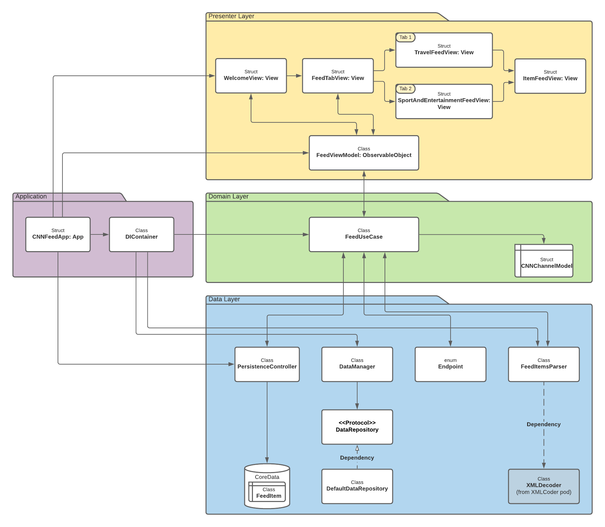

# CNN Feed Application
This application show you news from CNN’s RSS feeds: 
1. [Travel](http://rss.cnn.com/rss/edition_travel.rss)
2. [World Sport](http://rss.cnn.com/rss/edition_sport.rss)
3. [Entertainment](http://rss.cnn.com/rss/edition_entertainment.rss)

## Architecture
MVVM architecture pattern and Clean architecture with three layers:
- **Presenter layer**
  - contains `Views` and `FeedViewModel` (MVVM architecture pattern)
  
- **Domain layer**
  - contains use cases and connect between Presenter layer and Data layer
  - `CNNChannelModel`(`Codable`) - model that we got from the CNN server

- **Data Layer**
  - contains CoreData storage with FeedItem model
  - `DataManager` - manage our requests to CNN server. `DefaultDataRepository` that implements `DataRepository` protocol (Strategy design pattern – We can add in the future `DataRepositoryTest` that implements `DataRepository` protocol)
  - `Endpoint` - URLs path to connect to CNN server

### **Application**
  - `DIContainer` – help us to inject the dependencies (Factory and Dependency injection design patterns)

## Dependencies - Pods
- We use [`XMLCoder`](https://github.com/MaxDesiatov/XMLCoder) that parse XML response from CNN’s RSS channel using `Codable`

## System requirement
- iOS 14.0+
- Xcode 12.0+
